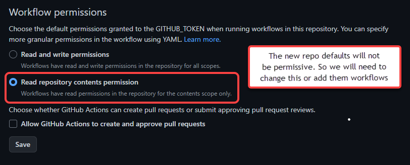

There are some actions created that will build the binaries and create and artifacts. They can be viewed here:

<https://github.com/userdocs/qbittorrent-nox-static/actions>

Most of these actions are triggered manually by clicking on the action and running the workflow meaning you can fork the repo and use the workflows you require. Patching will work with the `multi_arch` actions as long as you configure it correctly in the action first.

These are the currently available actions.

> [!tip|iconVisibility:hidden|labelVisibility:hidden|style:callout] `matrix_multi_build_and_release.yml` also generates releases based on the qbittorrent and libtorrent tags used. The release is created when the first matrix build completes and the other builds update this release as they complete.

```bash
# CI triggered on pushes to the build script. Tests on x86_64 Debian buster/sid Ubuntu Focal/hirsute to make sure it all works on these platforms.
debian_based_CI.yml

 # qbittorrent-nox qmake, cmake, libtorrent v1 and v2 multi build and release across these architectures - x86_64 armhf armv7 aarch64 cross built via musl prebuilt toolchains. 32 builds are created. 16 per release.
matrix_multi_build_and_release.yml

# Same as above but with options to specificy tags so that I can update previous releases.
matrix_multi_build_and_release_customs_tags.yml

# Uses https://github.com/userdocs/qbt-workflow-file to create artifacts of dependencies for the worklows.
matrix_multi_build_and_release_artifacts.yml


# Uses https://github.com/userdocs/qbt-workflow-file as a source for dependencies for the worklows.
matrix_multi_build_and_release_qbt_workflow_files.yml
```

### Github repo Actions settings

The only permissions these actions should need is:

```yaml
    permissions:
      contents: write
```

These are already set and should require not modification in the forked repo to run successfully.

These should be the default settings for recently forked versions of this repo that require this permission.



You can find these settings bu going to the repo settings/actions/general

